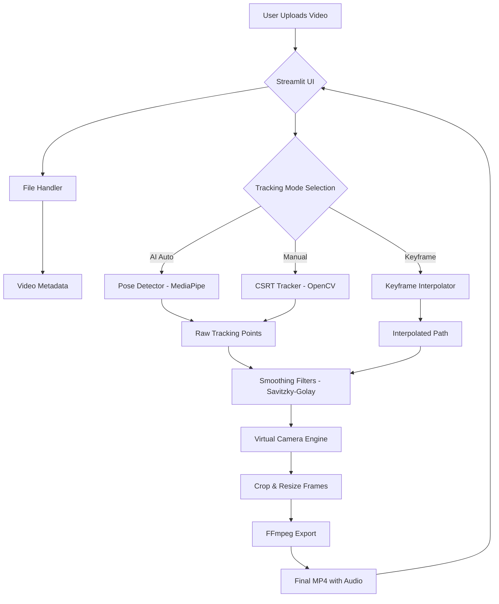

# DanceTrack AI Architecture

The system is designed with a clear separation between the UI (Streamlit), the Tracking Logic, and the Rendering Engine (FFmpeg).

## System Flow

## Component Description

- **Pose Detector**: Uses MediaPipe to find 33 body landmarks. Calculates the center point based on shoulders and hips.
- **Manual Tracker**: Uses OpenCV's CSRT for robust object tracking.
- **Camera Path Manager**: Handles data storage and interpolates between sparse keyframes using Cubic Splines.
- **Smoothing Utils**: Implements signal processing filters to remove camera shake.
- **Video Processor**: Calculates crop coordinates frame-by-frame and prepares them for final encode.
- **FFmpeg Exporter**: Manages final assembly of processed frames and audio.
